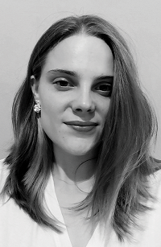
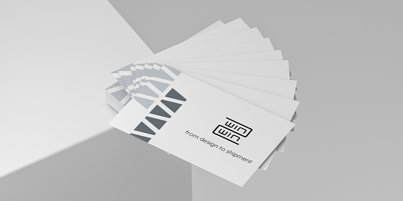

# WHO IS NATALIE?

I'm self-taught, who’s design path started as a hobby in illustrations and art creations. Soon progressed into a passion for design. Today, I enjoy working creatively for smaller and bigger brands to develop their identity beyond a logo.

***Currently*** I’m a graphic graphic designer and illustrator in Impact Hub Czech Republic. Taking care of the visual side and collaborating with the marketing team on the growth and new implementations.

## FEATURE PROJECT

### Business Card Design

- YEAR
 - 2021

- INDUSTRY
 - Sewing Service

- SCOPE
 - Visual Direction
 - Color and Type
 - Business Card Design
 - Print Ready Files

[***CHECK IT OUT***](03-content-first)

