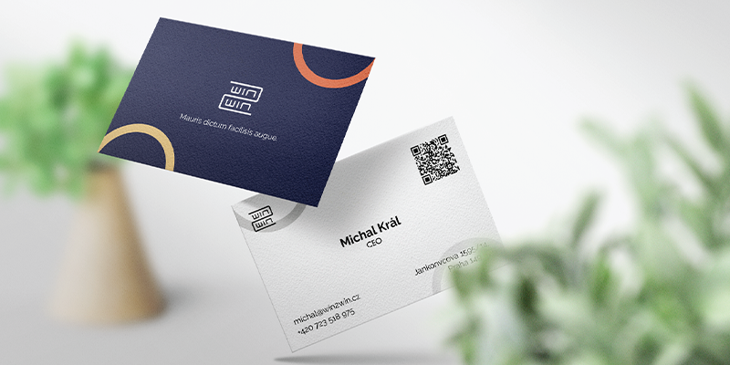
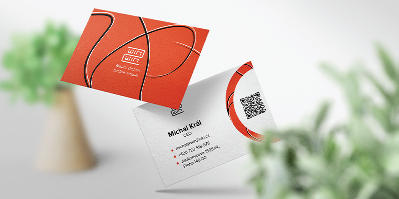
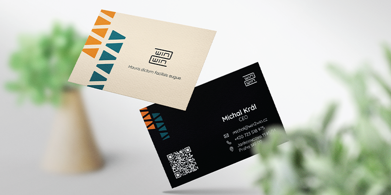
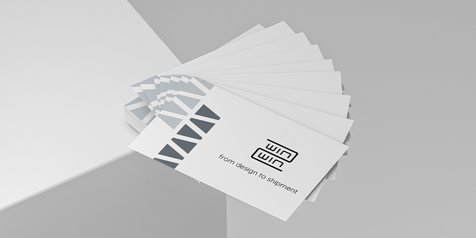
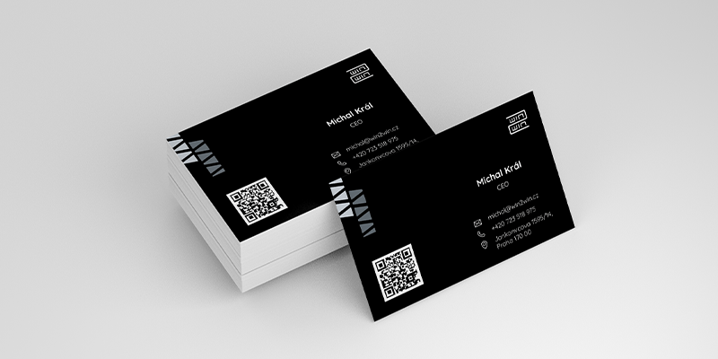

# BUSINESS CARD DESIGN
- - - 
Client: WIN2WIN s. r. o.

 
 

***Win2win*** is a czech company that offers sewing and repair services. They use different materials from zippers and shoelaces to various clips, hooks, and loops.

Company was in need of a business card and they got back to me with the request of helping them to create a _modern and minimalist business card design_. They gave me creative freedom in terms of colors, elements and typography. So there were pretty much no boundaries in the design process.

 
 

## FIRST IDEAS
I have introduced 3 versions of the business card design to the client and explained to him my vision and intention behind each visual.
I have decided to use playful and vibrant colors, sans-serif fonts that underline modern feel of the business card.

 
 

- VERSION 1
    - Clip Element

 
 

- VERSION 2
    - Shoelace Element

 
 

- VERSION 3
    - Zipper Element

 
 

After my client had reviewed my ideas, he decided to go with the layout that contains zipper element. The only change was to use contrasting color palette
in black and white spectrum.

 
 

## FINAL

 
 

As for the result, I have prepared print files for my client and his team. To summarize, I really enjoyed working on this project and also the smooth collaboration between me and the client.

