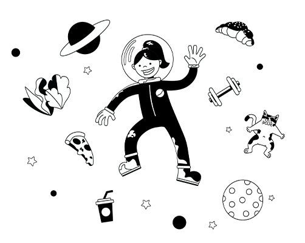

# Experience

- - -

# Natálie Šedivá

Passionate Graphic Designer and Illustrator

- CONTACT
    - natalie@spotless-design.com
    - +420 736 660 918
    - www.spotless-design.com

 
 

## EDUCATION

### University of Creative Communication in Prague
_2020-NOW Bachelors Degree - Final Year_

Faculty of Graphic and Media Design

 
 

## EXPERIENCE

### Impact Hub Czech Republic
- _2022-NOW Creative and Marketing Team_

Working as a Graphic Designer and Illustrator. I assist with creation of Web and Ad Banners, Campaigns, Illustrations and Social Media Posts.
In collaboration with the Marketintg Team I provide Design Thinking and Visual Direction.

 
 

### Ematix
- _2022 Creative Team_

Working as a Junior Graphic Designer. My tasks were mainly Social Media Posts, Campaign Posters adn Web Banners

 
 

### Extern Shortterm and Longterm Projects
- _202O-NOW Freelancing_

Working as an Extern Graphic Designer and Illustrator. My freelance work includes various types of jobs - Desktop Publishing, Branding and Logo Design, Illustration, Video Editing or Infographics and Icons.

 
 

## SKILLS

✔️ Logo Design 
✔️ Corporate Branding 
✔️ Web & Ad Banners 
✔️ Desktop Publishing 
✔️ Vector Graphics 
✔️ Illustrations 
✔️ Video Editing 

 
 

## TOOLS

🟣Adobe Illustrator 
🟣Adobe Photoshop 
🟣Adobe Indesign 
🟣Figma 
🟣Google Slides/Powerpoint 
🟣Adobe Premiere 

