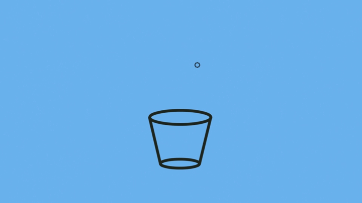
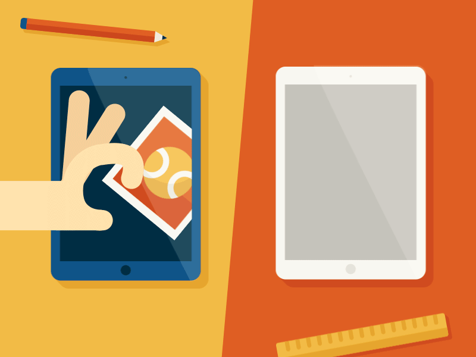
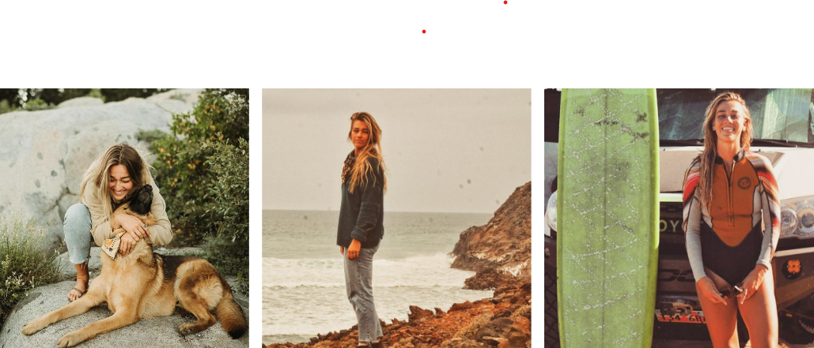
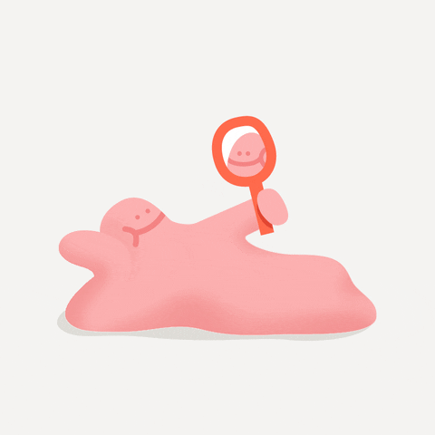
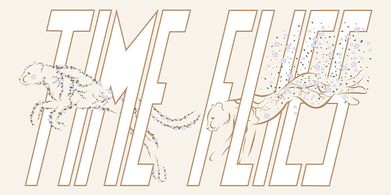
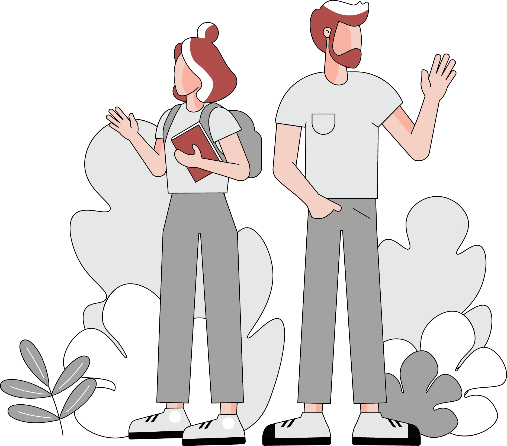

# FINDING YOUR STYLE
- - -

So I was wondering what is it that I would like to speak about and make an presentation about. And during our mindmap excerscise I find out that it has to do something with finding my style, finding motivation or inspiration. Having these topics written on the paper it led me to think of list of activities, where I am dealing with these topics. And one of them were illustrations. In order to that I will demostrate this presentatioon on Illustrations!

 
 

So I don’t know how many of you also have the experience, but when applying to job posts I got many questions like and what is your art style?
I was like wait, but I do not have one. What should I do now? I need to find my style!

***Let's say it at the beggining,*** you do not find your own art style you develop it, after years of practice.

 
 

 It is similar to when your music taste developes or you find your favorite drink or movie - it is a discovery process that continues to evolve through your life.
 
 
 

## Here are some tips to guide you in developing your style:

**1. Expose yourself to more art** - start following astists on SM and make a moodboard of styles you like. This will help you to narrow down to style of art you like.

 
 

**2. Your art style is your artistic finger print** - all these elements such as color pallete, composition and artistic skills evolves from your personality, sense of humor, perspective and values. So we can say that wheneever you are drawing you are in the same time unconscioussly drawing in your style.

 
 

**3. Draw a lot** - in order to develop your style you need to draw a lot. But if you struggle like me with finding motivation what to draw, you can join some drawing challanges and this way you will be pushed to practise everyday and also see ispiration from others. 

***When you practise always commit to quantity over quality.***

 
 

**4. Invest in yourself** - dedicate time to yourself and invest on new supplies - brand new artbook or ipad. This is another way how to reward yourself and motivate yourself that you are doing something valuable and important to you.

 
 

**5. Don't be afraid to evolve** - be open to evolve and discover with mindset of growth, keep trying new styles or media you find interesting and fun to help you develop and grow your art style.

 
 

## Let's see one developed style example

Can you guess how her art style LookS like? Where she takes inspiration from?
If you are ready, reveal her style to see if you were close!

[***CLICK TO REVEAL***](https://raycodesign.com/artwork)

 
 

## Some final thoughts

***“Personal style is accepting who you are.”*** - Diane Von Furstenberg

I think that when you get to this point of understanding yourself and accepting your nature. It will get much easier to just surround yourself with the inspiration and motivation you need and that way to develop your style!

 
 

## A little bonus - showcase of my *(in progress)* style

