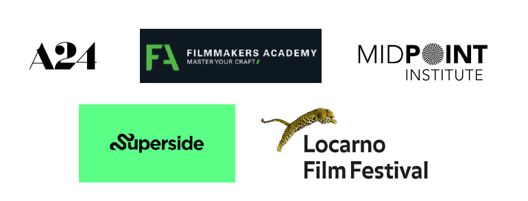
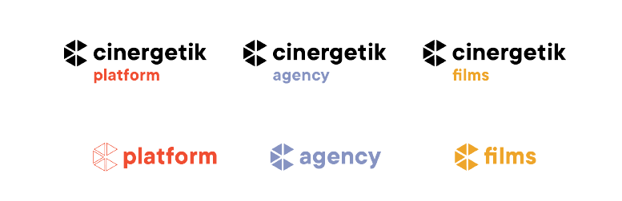
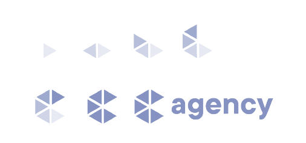
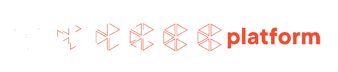
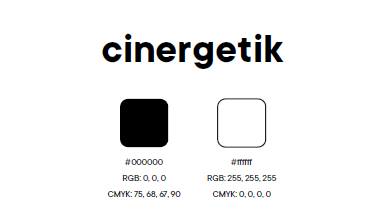
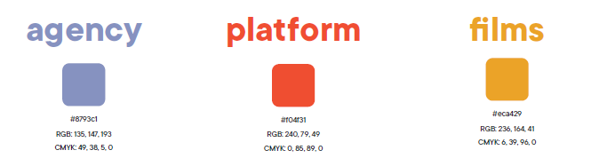
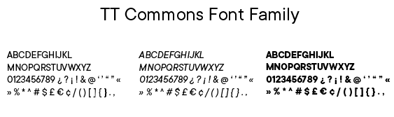
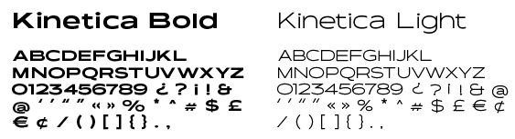
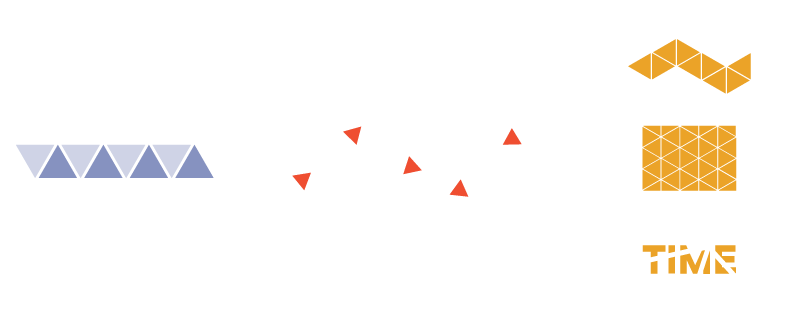

# BACHELOR'S THESIS
## Corporate Indentity Design of an Innovative Film Production Company
- - -

When choosing a topic for my bachelor's thesis, it was crucial that it is close to me and I know
something about it. I have always been fascinated by the world of film and was attracted by its
artistic value. My visit to the Locarno Film Festival became a big inspiration. I admired the
creativity across the festival architecture, promotional materials and other details.

This experience led me to the decision to approach the founder of the film and video production
company Cingeretic and develop a corporate identity proposal for his company. Cingeretik offers
a complete package of services consisting of film and video production, but also creates
educational content for filmmakers all over the world. It aims to create an international network
of filmmakers an d creatives and wants to operate fully online. The goal of my work is to create
an optimal corporate identity that will clearly communicate the corporate values of Cingertetik.

## Film Industry Definition

At the beggining, it was important for me to understand what is the film industry made of.
Thanks to the conversations I had with client and to the research I did, I gained valuable facts.
It is all about collaboration between different departements of the film industry in order to
create a movie. This sector provides many professional opportunities and can also have an
economic impact on tourism.

## Analyses of visual styles

I focused on researching companies that have many elements in common with Cingertetik. For a
more detailed analysis, I have sele cted the ones that contribute to the development and support
of the film and creative industry.

I was mainly interested in their work with visual identity and the way they communicate with
their supporters and surroundings. In more detail, activities in th e online world, on websites and
social networks. A24, Filmmakers Academy, Midpoint Institute, Superside, Locarno.

## About Cinergetik

Cinergetik describes itself as a film and media company that uses digital technology to innovate
the way filmmakers tell stories. Through the Collective Storytelling concept, the company
focuses on developing tools and methods for effective collaboration b etween creative talents
from around the world. Believing that there are meaningful stories within each of us that need
to be told, they will focus on spreading the knowledge and access to resources that filmmakers
need to perfect their craft and produce qu ality films.

In my next steps of building visual style I have analysed the strenghts, weaknesses, oppurtunities and threats of the company.
Then created the moodboard to help me with defining target and threats of the company. Then created the moodboard to help me with defining target groups.groups.

## Visual Style

The visual style for Cingertetik is based on the knowledge I determined earlier. It is designed in
such a way that it can communicate the essence of the company and speak to the surroundings
with its dynamism and cinematic elements. I chose the geometric shape of a triangle to represent the
style. A triangle is a specific shape that evokes imagination, otherness and creativity just by its appearance.
I take advantage of the fact that the triangle is three sided and at the end of each edge I place one department of the
company, which together form Cingertetik.

## Logo

Logo consists of the Cingertetik symbol and logotype. The logo represents the film
community with its playful yet minimalist look. I achieved this by choosing a sans serif font
and choosing a contrasting color of black and white.

The symbol is composed of five triangles in the shape of the letter C. This shape is defined by
the appearance of the camera lens, where the triangles symbolize the apertures. Collectiveness
and cooperation is another element of the symbol, each triangle is a unique part of the whole
Cinergetik.

Here are versions of logos for each departement of Cinergetik company.

## Animations

Motion and effects are important to the cinematic world, so I decided to create an animation for
each logo variant. Animations will add originality and a technological atmosphere to the logo.
Animations symbolize the process of creation and collaboration.

## Colors

For Cingertetik I used black and white to maintain the tonality of the company. I chose a For Cingertetik I used black and white to maintain the tonality of the company. I chose a deep matte orange for Platform to radiate energy and strength. Fdeep matte orange for Platform to radiate energy and strength. For Agency, I chose a deep light or Agency, I chose a deep light blue to evoke a sense of trustworthiness and stability. And for Films, I chose a yellow shade blue to evoke a sense of trustworthiness and stability. And for Films, I chose a yellow shade with a hint of orange to exude mystery and technology.with a hint of orange to exude mystery and technology.

## Type

The visual style consists of modern sans-serif fonts of the TT Commonsserif fonts of the TT Commons font family, which are font family, which are universal and legible thanks to the sharpness of the characters. I use Regular, Italic and Bold universal and legible thanks to the sharpness of the characters. I use Regular, Italic and Bold typefaces for both print and digital materials. As a complementary font, I chose Kinetica with typefaces for both print and digital materials. As a complementary font, I chose Kinetica with Bold and Light cuts, which are inspired bBold and Light cuts, which are inspired by movement and will stand out on social networks and y movement and will stand out on social networks and printed matter.printed matter.

## Graphic elements

The visual style includes typography, colors and graphic elements that are based on the logo symbol, made up of triangles. Graphic elements are used for social networks, symbol, made up of triangles. Graphic elements are used for social networks, printed materials, printed materials, promotional materials and corporate architecture.promotional materials and corporate architecture.

## Illustrations

Illustrations were created for the platform, as a place with educational content. Triangular figures will help to communicate ideas, company values and a wide content of inffigures will help to communicate ideas, company values and a wide content of information in a ormation in a fun way. Illustrations are suitable for output on social networks and videos, where it will be fun way. Illustrations are suitable for output on social networks and videos, where it will be possible to partially animate them and thus create engaging content. Their function is mainly possible to partially animate them and thus create engaging content. Their function is mainly secondary.secondary.

## Communication

When creating communication, I decided whether the brand would communicate only its , I decided whether the brand would communicate only its service in a more corporate way or if it would also spread its image. I went with the second service in a more corporate way or if it would also spread its image. I went with the second option and came up with a few slogans that could convey the company's internal values to the option and came up with a few slogans that could convey the company's internal values to the target group target group and prescribe the visual style. Since this is a company that will operate remotely and prescribe the visual style. Since this is a company that will operate remotely online, I focused on the preparation of visuals for communication on social networks, but I also online, I focused on the preparation of visuals for communication on social networks, but I also designed a poster, merch and signposts. I also worked on the design of the wdesigned a poster, merch and signposts. I also worked on the design of the website for ebsite for Cingertetik.Cingertetik.

## Slogan

The main slogan is "Collective Storytelling". It can appear in the animation after the logo, in the main communication, hashtag or on company printed materials. It also gives rise to the the main communication, hashtag or on company printed materials. It also gives rise to the marketing slogans "Born to Storytell" marketing slogans "Born to Storytell" and "Place where you get creative from every and "Place where you get creative from every [tri]angle", which would supplement the content of campaigns, promotional materials, and [tri]angle", which would supplement the content of campaigns, promotional materials, and appear on social networks or websites. They can be used across all sections of the companyappear on social networks or websites. They can be used across all sections of the company

