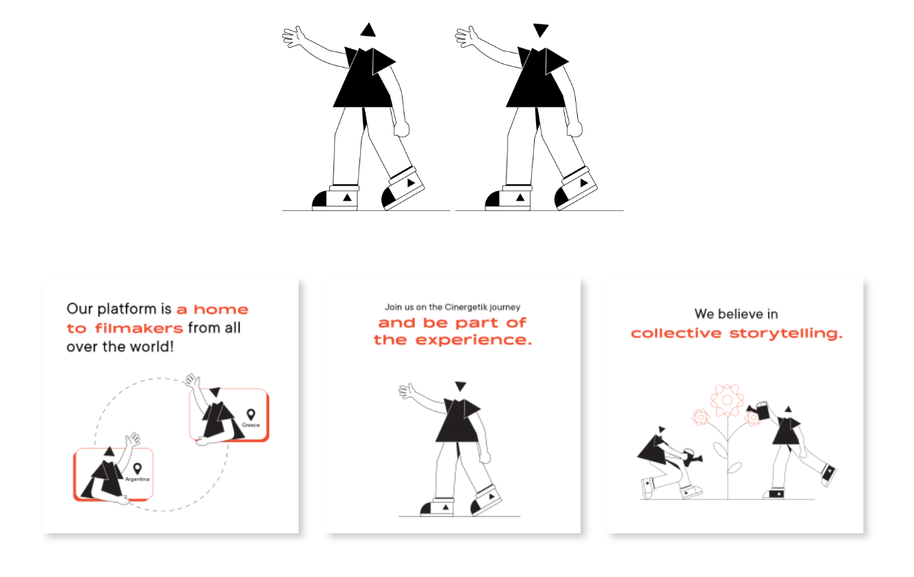

# BACHELOR'S THESIS
## Corporate Identity Design of an Innovative Film Production Company
- - -
- 

When choosing a topic for my bachelor's thesis, it was crucial that it is close to me and I know
something about it. I have always been fascinated by the world of film and was attracted by its
artistic value. My visit to the Locarno Film Festival became a big inspiration. I admired the
creativity across the festival architecture, promotional materials and other details.

This experience led me to the decision to approach the founder of the film and video production
company Cingeretic and develop a corporate identity proposal for his company. Cingeretik offers
a complete package of services consisting of film and video production, but also creates
educational content for filmmakers all over the world. It aims to create an international network
of filmmakers an d creatives and wants to operate fully online. The goal of my work is to create
an optimal corporate identity that will clearly communicate the corporate values of Cingertetik.

## Film Industry Definition

At the beggining, it was important for me to understand what is the film industry made of.
Thanks to the conversations I had with client and to the research I did, I gained valuable facts.
It is all about collaboration between different departements of the film industry in order to
create a movie. This sector provides many professional opportunities and can also have an
economic impact on tourism.

## Analyses of visual styles

I focused on researching companies that have many elements in common with Cingertetik. For a
more detailed analysis, I have sele cted the ones that contribute to the development and support
of the film and creative industry.

I was mainly interested in their work with visual identity and the way they communicate with
their supporters and surroundings. In more detail, activities in th e online world, on websites and
social networks. A24, Filmmakers Academy, Midpoint Institute, Superside, Locarno.

## About Cinergetik

Cinergetik describes itself as a film and media company that uses digital technology to innovate
the way filmmakers tell stories. Through the Collective Storytelling concept, the company
focuses on developing tools and methods for effective collaboration b etween creative talents
from around the world. Believing that there are meaningful stories within each of us that need
to be told, they will focus on spreading the knowledge and access to resources that filmmakers
need to perfect their craft and produce qu ality films.

In my next steps of building visual style I have analysed the strenghts, weaknesses, oppurtunities and threats of the company.
Then created the moodboard to help me with defining target and threats of the company. Then created the moodboard to help me with defining target groups.groups.

## Visual Style

The visual style for Cingertetik is based on the knowledge I determined earlier. It is designed in
such a way that it can communicate the essence of the company and speak to the surroundings
with its dynamism and cinematic elements. I chose the geometric shape of a triangle to represent the
style. A triangle is a specific shape that evokes imagination, otherness and creativity just by its appearance.
I take advantage of the fact that the triangle is three sided and at the end of each edge I place one department of the
company, which together form Cingertetik.

## Logo

Logo consists of the Cingertetik symbol and logotype. The logo represents the film
community with its playful yet minimalist look. I achieved this by choosing a sans serif font
and choosing a contrasting color of black and white.

The symbol is composed of five triangles in the shape of the letter C. This shape is defined by
the appearance of the camera lens, where the triangles symbolize the apertures. Collectiveness
and cooperation is another element of the symbol, each triangle is a unique part of the whole
Cinergetik.

Here are versions of logos for each departement of Cinergetik company.

## Animations

Motion and effects are important to the cinematic world, so I decided to create an animation for
each logo variant. Animations will add originality and a technological atmosphere to the logo.
Animations symbolize the process of creation and collaboration.

## Colors

For Cingertetik I used black and white to maintain the tonality of the company. I chose a For Cingertetik I used black and white to maintain the tonality of the company. I chose a deep matte orange for Platform to radiate energy and strength. Fdeep matte orange for Platform to radiate energy and strength. For Agency, I chose a deep light or Agency, I chose a deep light blue to evoke a sense of trustworthiness and stability. And for Films, I chose a yellow shade blue to evoke a sense of trustworthiness and stability. And for Films, I chose a yellow shade with a hint of orange to exude mystery and technology.with a hint of orange to exude mystery and technology.

## Type

The visual style consists of modern sans-serif fonts of the TT Commonsserif fonts of the TT Commons font family, which are font family, which are universal and legible thanks to the sharpness of the characters. I use Regular, Italic and Bold universal and legible thanks to the sharpness of the characters. I use Regular, Italic and Bold typefaces for both print and digital materials. As a complementary font, I chose Kinetica with typefaces for both print and digital materials. As a complementary font, I chose Kinetica with Bold and Light cuts, which are inspired bBold and Light cuts, which are inspired by movement and will stand out on social networks and y movement and will stand out on social networks and printed matter.printed matter.

## Graphic elements

The visual style includes typography, colors and graphic elements that are based on the logo symbol, made up of triangles. Graphic elements are used for social networks, symbol, made up of triangles. Graphic elements are used for social networks, printed materials, printed materials, promotional materials and corporate architecture.promotional materials and corporate architecture.

## Illustrations

Illustrations were created for the platform, as a place with educational content. Triangular figures will help to communicate ideas, company values and a wide content of inffigures will help to communicate ideas, company values and a wide content of information in a ormation in a fun way. Illustrations are suitable for output on social networks and videos, where it will be fun way. Illustrations are suitable for output on social networks and videos, where it will be possible to partially animate them and thus create engaging content. Their function is mainly possible to partially animate them and thus create engaging content. Their function is mainly secondary.secondary.

## Communication

When creating communication, I decided whether the brand would communicate only its , I decided whether the brand would communicate only its service in a more corporate way or if it would also spread its image. I went with the second service in a more corporate way or if it would also spread its image. I went with the second option and came up with a few slogans that could convey the company's internal values to the option and came up with a few slogans that could convey the company's internal values to the target group target group and prescribe the visual style. Since this is a company that will operate remotely and prescribe the visual style. Since this is a company that will operate remotely online, I focused on the preparation of visuals for communication on social networks, but I also online, I focused on the preparation of visuals for communication on social networks, but I also designed a poster, merch and signposts. I also worked on the design of the wdesigned a poster, merch and signposts. I also worked on the design of the website for ebsite for Cingertetik.Cingertetik.

## Slogan

The main slogan is "Collective Storytelling". It can appear in the animation after the logo, in the main communication, hashtag or on company printed materials. It also gives rise to the the main communication, hashtag or on company printed materials. It also gives rise to the marketing slogans "Born to Storytell" marketing slogans "Born to Storytell" and "Place where you get creative from every and "Place where you get creative from every [tri]angle", which would supplement the content of campaigns, promotional materials, and [tri]angle", which would supplement the content of campaigns, promotional materials, and appear on social networks or websites. They can be used across all sections of the companyappear on social networks or websites. They can be used across all sections of the company

## Social Media

Cingertetik's activity on social networks is key. It is important that brand unity is maintained in posts and across accounts of individual branches of the entity. Graphical elements are therefore ubiquitous, even if they behave differently. Cinergetik will apply its scope to Instagram, Facebook, LinkedIn, Twitter and YouTube. She decided to apply the visual style to the design for the Instagram accounts of individual departments.

The importance of communicating the range of services provided by a corporate agency on their Instagram profile is emphasized. I have created visuals featuring team members or industry professionals explaining the importance of services, with triangles placed in the background and moderate use of typography. Other proposed content includes showcasing the inside of the agency through carousels featuring birthday celebrations or non-work related activities, as well as featuring reviews from satisfied clients as a way to increase website traffic and establish a deeper relationship with potential customers.

The Instagram profile for a platform consists of posts featuring lessons, workshops, a podcast, or news from the world. I have created layouts using animated visuals with scattered triangles in the posts featuring lessons for filmmakers. Another proposal is to use triangles scattered freely in the  visuals for the podcast posts. Where will be discussed various topics from the world of filmmaking, innovation, and technology. The last proposal is for a "Just Now" session that summarizes important news and will lead to the full article located on the website's blog section.

For film production Instagram profile, contributions are mainly based on film samples from filming or from film festivals and events. I decided to use for a movie previews a mirroring triangle effect that gets smaller and disappears as the prewiew continues. Another proposed idea is a carousel of photos from events organized by Cingertetik, where the pattern covers parts of the photos while also connecting them. The last proposed idea is a typographical variant of the broken effect in the posts from filming scene.

## Web

I created a website design that will serve as the main source of information about Cingertetik, services, events and more. In the design process, I analyzed the parameters for an optimal user experience when visiting the website, and then used wireframes to assemble the content of the website, which I then converted into the final visual form. On the first page, there is a dominant heading with text describing the range of services. The sign attracts website visitors with its clear message. By scrolling down, a corporate promo video presenting the Cingeretic concept appears. Just below it are located icons and short texts summarizing the goals and values of the company. When we move further, we get to the section of the offer of services, where successive sections of the company appear.

First we are introduced with a picture and a short text with the title corporate agency, then the production company and finally the platform. Each of these shapes is distinguished by the respective colors of the individual departments. Then we get to the client reviews section, and finally the main page ends with links to social media profiles and a tagline. Below it is other summary information that is related to the content of the site. The website is designed in shades of black. Typography in contrasting white color thus becomes a distinctive element. A delicate pattern of triangles is interwoven in the background. It is made up of a gradient of black to gray shades, and its blending will be animated as the page moves. This will give the site a futuristic and mysterious feel that will transport visitors to a cinematic atmosphere.

## Offline

I designed a series of posters for offline communication. The agency can speak to the surroundings through posters designed to promote the offer of services. In the layout, I work with a short and striking title and supplement it with an email contact and information about the Cingertetik website. Posters would be placed on advertising surfaces in the area of office buildings.

The other posters are a trio of layouts for Cingertetik. The symbol and typography is a prominent element of the visual. I work here with the main and marketing slogans: "Collective Storytelling", "Born to Storytell" and "Place where you get creative from every [tri]angle". The poster series has a cohesive feel. Tonally, the posters communicate without being juxtaposed.

## Corporate architecture

The company's visual style is also prescribed in corporate architecture, where it is used to create a special routing system and to decorate the office space or the filming room, so that everyone who enters the space realizes that they are surrounded by the Cingeretic concept.

## Merch

When designing promotional items, I was guided by the knowledge I gained from analyzing other film and creative subjects. I focused on products that could be used as part of promotion at events and festivals, but could also serve as gifts for new employees and supporters.

## Conclusion

My bachelor's thesis focuses on creating a corporate identity concept for Cingertetik, which I then implement visually. The theoretical part of the thesis discusses important graphic and marketing terms related to corporate identity, with examples of companies from the film and creative industry. The practical part defines who Cingertetik is and their philosophical values. Before creating a new corporate identity concept, I expanded gained knowledge and facts into a visual style and overall communication. The goal was to create a corporate identity that defines the brand with its visuals and language based on its philosophy, which was achieved through the usage of geometry, expressiveness of triangles, typography, and colors. I believe that the new corporate identity captures the cinematic and creative environment and paves the way for innovation and uniqueness. The outputs will be handed over to the company's founder for further collaboration.

